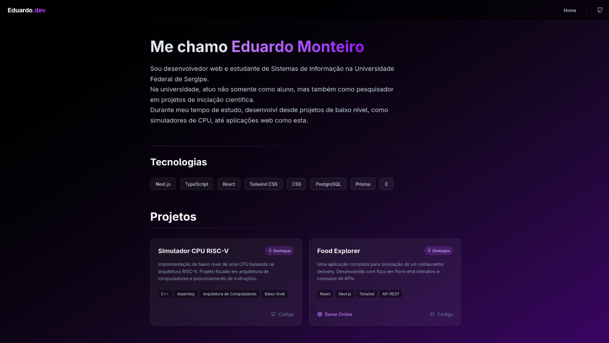

# 🚀 Portfólio Profissional - Eduardo Monteiro

> Uma Landing Page moderna desenvolvida para apresentar minha trajetória e projetos acadêmicos e profissionais.

## 💻 Tecnologias Utilizadas:

- **Framework:** [Next.js 14+](https://nextjs.org/)
- **Linguagem:** [TypeScript](https://www.typescriptlang.org/)
- **Estilização:** [Tailwind CSS](https://tailwindcss.com/)
- **Banco de Dados:** [PostgreSQL](https://www.postgresql.org/)
- **ORM:** [Prisma](https://www.prisma.io/)
- **Ícones:** [Lucide React](https://lucide.dev/)
- **Fonte:** Roboto / System Font
